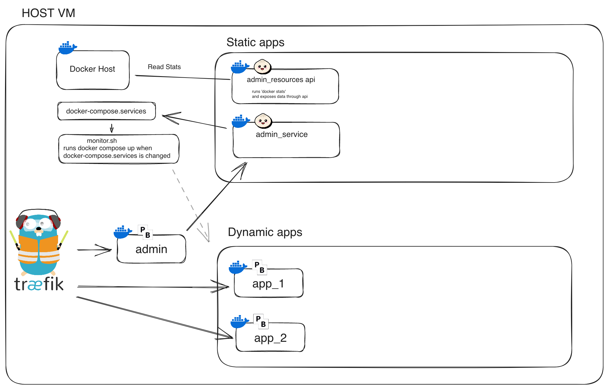

# Pocketkube
A small service for hosting several pocketbase instances in the same environment.

### Linux server dependenices
fswatch
```
sudo apt update  
sudo apt install fswatch
```

docker
```
TODO: add install
```

### Getting started
Fill inn environment variables in .env

cd into project folder and run:  
`chmod +x ./scripts/addAuthToTraefik.sh && chmod +x ./scripts/stop_containers.sh && chmod +x ./scripts/start_containers.sh && chmod +x ./scripts/monitor.sh`  

#### Build and start containers
`./start_containers.sh`  
Add a username and password for you traefik dashboard when prompted.  
Visit your host at host/admin/_/ for admin dashboard.  
Add entry to "backends" table.  
Visit your host to see your Traefik Dashboard. Validate that your new service is running at host/<app_title>  
Go to host/<app_title>/_/ to access Pocketbase dashboard.  





### Traefik docs
https://doc.traefik.io/traefik/v2.10/operations/api/


#### Generate password ith htpasswd
Generate a username and password hashed wihth bcrypt. Output the admin:hashed password with escaped $ signs.

`echo $(htpasswd -nbB USER "PASS") | sed -e s/\\$/\\$\\$/g`

#### How to run
Start in development mode: `bun run dev`  
Stop all containers `bun run stop`

## PocketKube Components

### Linux Ubuntu Host
This is the machine that will run all your backend servers.

#### Traefik
Traefik handles all the incoming network traffic and acts as a reverse proxy to the other pocketbase instances.  
Traefik automatically picks up new Docker Containers which are running on the host machine.

#### Docker
Every pocketbase instance is launched inside it's own separate Docker Container. 

### Static Services
PocketKube provides a set of services out of the box, these are

#### Admin Pocketbase
This is the admin pocketbase which lists all your apps. To add a new app simply add a new record to the "backends" collection

#### Admin Service
This micro service listens for updates from the `Admin Pocketbase` service.  
If a change occurs, this service will rebuild a dynamic `docker-compose.services.yml` file.  

#### Monitoring script
This is a script which runs on the host machine and listens for changes on the `docker-compose.services.yml` file.  
If a change occurs this script will run `docker-compose up` 

#### Admin Resources API
This micro service can get docker container resource information from the host and exposes this as an API.  


#### TODO ✓
- [ ] Add CORS headers
- [ ] Start all services on startup  
- [ ] Create interface for managing apps
    - [x] Design UI
    - [ ] System Architecture
    - [ ] Added Pocketbase Auth for admin
    - [x] Monitor Storage
    - [x] Monitor CPU
    - [ ] Enable upload of webpage -> target data/<app.id>/public


#### In Progress


#### DONE ✓
- [x] Docker volumes for PB_data  
- [x] Containers always restart  
- [x] Create service which generates the docker-compose file
- [x] Create a service "admin" which serves as the backend admin
- [x] Containers always restart  
- [x] Setup env variables for root project folder
- [x] Setup env variables for root admin in pocketbase
- [x] Setup env variables
- [x] What to do when an app is deleted?
    - [x] Make volume folders named after ID instead of tile
    - [x] Ensure access to projects_data from admin
    - [x] Rename ID folder to DELETED_ID_TITLE
- [x] How to handle duplicate app names?  ---- Don't generate ID -> use title as ID?
- [x] Test deployment on linode
- [x] Add micro service for fetching resource status per app
    `docker stats --no-stream --format "table {{.Container}}\t{{.CPUPerc}}"`
    `docker stats --no-stream --format "table {{.Container}}\t{{.Name}}\t{{.CPUPerc}}\t{{.MemUsage}}"` <--- This lists all
    - [x] Storage
    - [x] CPU
    - [x] RAM
- [x] Figure out how to add HTTPS in production but not in dev


#### Not going to implement yet
- [ ] Minikube?


#### Troubleshooting
rm  ~/.docker/config.json  

Error  
`open /Users/nils/.docker/buildx/current: permission denied`  
Solution `sudo chown -R nils ~/.docker`  


###### Cannot connect to docker daemon
https://stackoverflow.com/questions/44084846/cannot-connect-to-the-docker-daemon-on-macos


###### load metadata for docker.io/library/alpine:latest  
`sudo nano ~/.docker/config.json`
Changing

"credsStore": "desktop"

to

"credStore": "desktop"


### Future features

Automatic stop and star containers if not active
https://acouvreur.github.io/sablier/#/